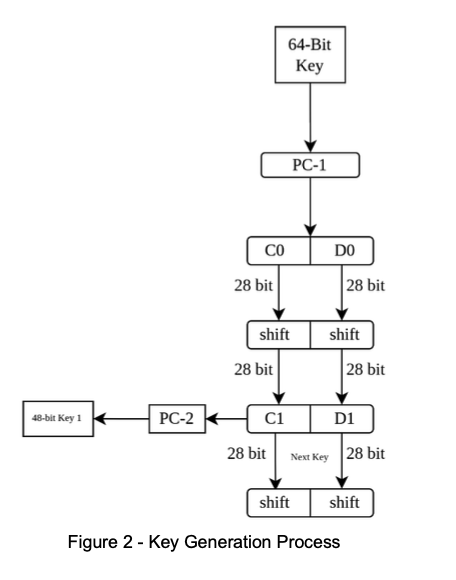
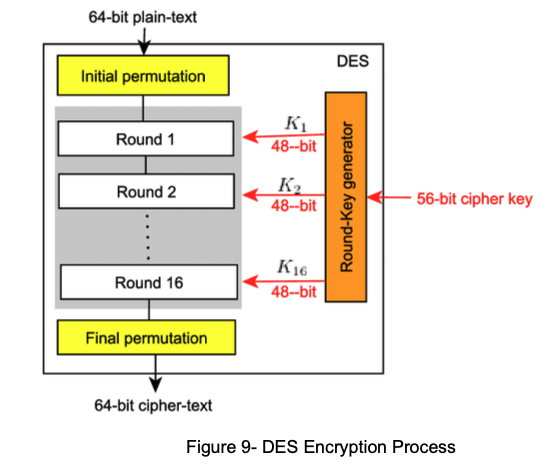

# Implementation of Manual DES

This project presents a complete manual implementation of the Data Encryption Standard (DES) in Python, following the official DES specification.

Unlike library-based implementations, this project recreates DES from scratch using:

* Predefined permutation tables (IP, FP, PC-1, PC-2, E, P)

* 16 Feistel rounds

* S-box substitution

* Key scheduling

* Manual encryption & decryption pipeline

The implementation strictly follows the DES standard structure described in your documentation

[Report-Task3pdf](./Report-Task3.pdf)


[](https://www.python.org/)
[](https://en.wikipedia.org/wiki/Data_Encryption_Standard)
[](https://en.wikipedia.org/wiki/Feistel_cipher)
[](https://en.wikipedia.org/wiki/Block_cipher)
[](https://en.wikipedia.org/wiki/Key_schedule)
[](https://en.wikipedia.org/wiki/S-box)
[](https://en.wikipedia.org/wiki/Cryptography)
[](LICENSE)

---
## Table of Contents

- [Project Overview](#project-overview)
- [DES Architechture](#des-architechture)
- [Permutation & Substitution Tables](#permutation--substitution-tables)
- [Project Structure](#project-structure)
- [Security Discussion](#security-discussion)
- [Key Learning Outcomes](#key-learning-outcomes)
- [Disclaimer](#disclaimer)
- [License](#license)

---

## Project Overview

the Data Encryption Standard (DES) is a symmetric-key block cipher that:

* Encrypts 64-bit blocks

* Uses a 56-bit effective key

* Applies 16 Feistel rounds

* Uses fixed permutation and substitution tables

As described in documentation, the DES process consists of:

* Key Scheduling

* Data Encryption

* Data Decryption

This project manually implements each phase without external cryptographic libraries.

---

## DES Architechture

DES follows a Fesitel network structure:
```
Plaintext (64-bit)
        ↓
Initial Permutation (IP)
        ↓
16 Feistel Rounds
        ↓
Swap (L16, R16)
        ↓
Final Permutation (FP)
        ↓
Ciphertext (64-bit)
```


### Phase1: Key Scheduling
key scheduling generates 16 round keys (48-bit each) from the original 64-bit key

<p align="left">

<br>
</p>

Steps:

* Apply PC-1 permutation (remove parity bits → 56 bits)

* Split into C and D halves (28 bits each)

* Perform left shifts (based on shift schedule)

* Apply PC-2 permutation

* Produce 16 subkeys

### Phase 2: DES Encryption Process

<p align="left">

<br>
</p>

Encryption includes:

#### Step 1 — Initial Permutation (IP)

Rearranges 64-bit plaintext using IP table.

#### Step 2 — 16 Feistel Rounds

Each round performs:

1. Expansion (E-table)

   * Expand 32-bit R to 48 bits

2. XOR with Round Key

3. S-box Substitution

    * 8 S-boxes

    * Each 6 bits → 4 bits
    
    * Output = 32 bits

4. P Permutation

    * Rearrange 32-bit output

5. Feistel Swap:
```python
L_i = R_(i-1)
R_i = L_(i-1) XOR F(R_(i-1), K_i)
```

#### Step3 - Final Permutation (FP)

After 16 rounds:

* Swap L16 and R16

* Apply FP permutation

* Output final ciphertext (hexadecimal format)

### Phase 3: DES Decryption Process

DES decryption uses:

* Same algorithm

* Same structure

* Same key

Difference:

Round keys are applied in reverse order.

```python
K16 → K15 → ... → K1
```
Because DES is a Feistel cipher, encryption and decryption share the same logic.


----

## Permutation & Substitution Tables

The implementation includes:

* Initial Permutation (IP)

* Final Permutation (FP)

* PC-1

* PC-2

* Expansion (E)

* P-permutation

* 8 DES S-boxes

All tables are manually defined according to DES standard.

---

## Project Structure
```
DES-Manual-Implementation/
│
├── Task3enc.py            # Main DES encryption logic
├── Task3dec.py            # Main DES decryption logic
├── Report-Task3.pdf       # Full academic documentation
├── README.md
└── LICENSE
```
### Execution Workflow

Run encryption:
```python
python3 Task3enc.py
```
Run decryption:
```python
python3 Task3dec.py
```

For complete theoretical explanation, permutation tables, execution screenshots, and algorithmic breakdown, please refer to: 
[Report-Task3.pdf](./Report-Task3.pdf)

---

## Security Discussion

DES is:

* Structurally elegant

* Historically significant

* Cryptographically outdated

**Weaknesses:**

* 56-bit key → vulnerable to brute force

* Replaced by AES

* Vulnerable to modern computational attacks

This project demonstrates the understanding of DES structure not using DES securely

Modern secure alternatives:

* AES

* ChaCha20

* RSA / ECC (for key exchange)

---

## Key Learning Outcomes 

* Understanding Feistel network structure

* Implementing key scheduling (PC-1, PC-2)

* Implementing S-box substitution

* Applying permutation tables

* Bit-level manipulation

* Manual encryption/decryption logic

* Understanding historical cryptographic standards

---

## Disclaimer

DES is considered insecure for modern applications and this implementation is strictly for educational and academic purposes.

---
 
## License 

This project is licensed under the MIT License - see the [LICENSE](LICENSE) file for details.
